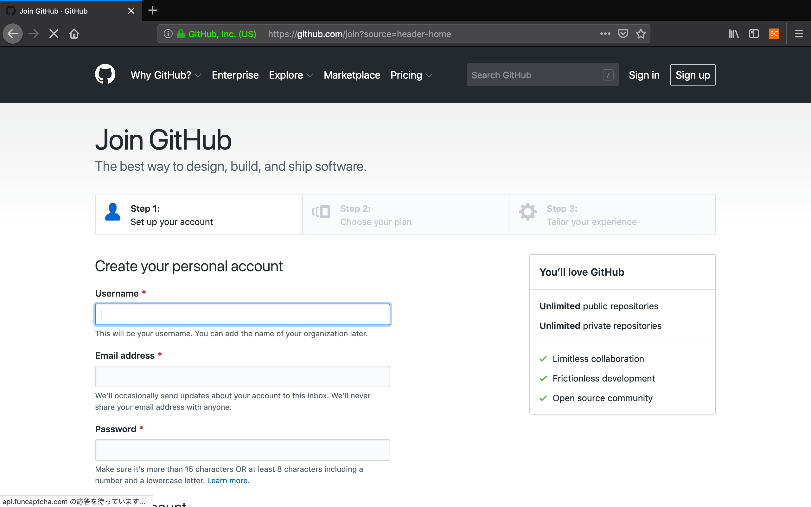
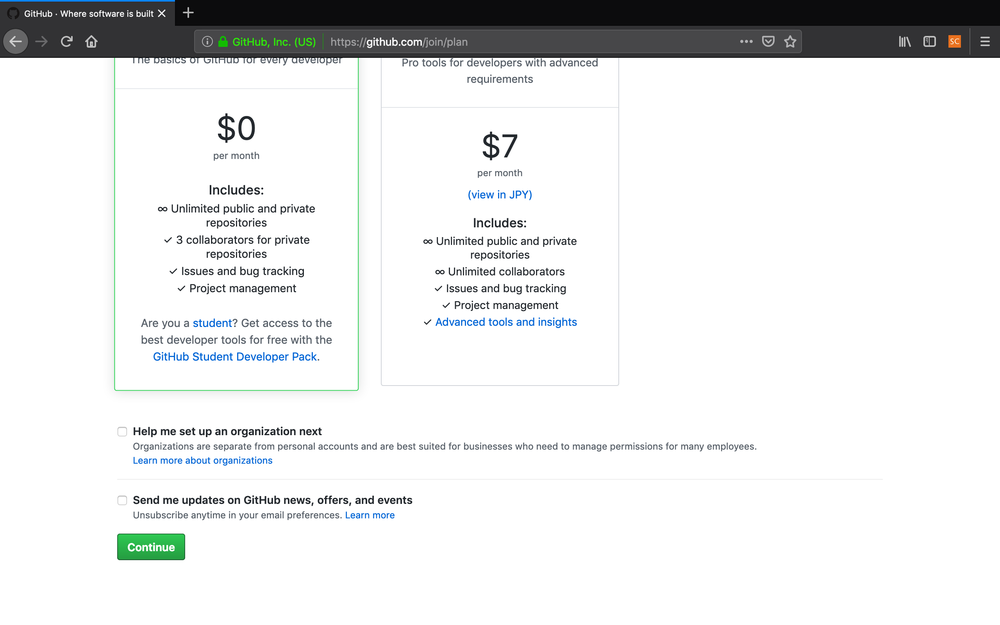
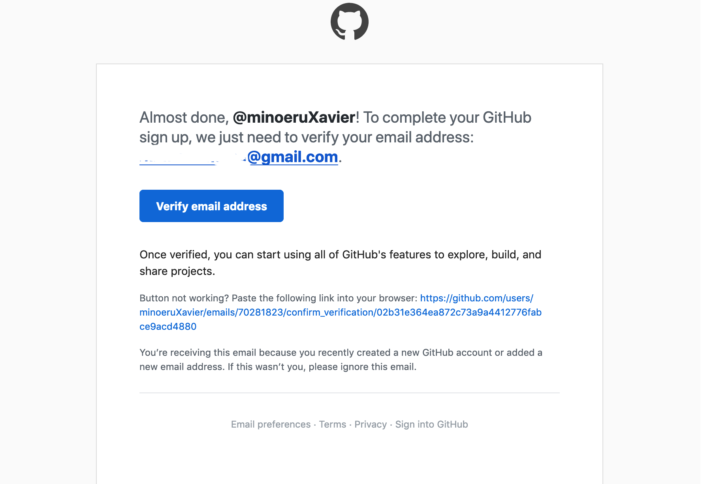
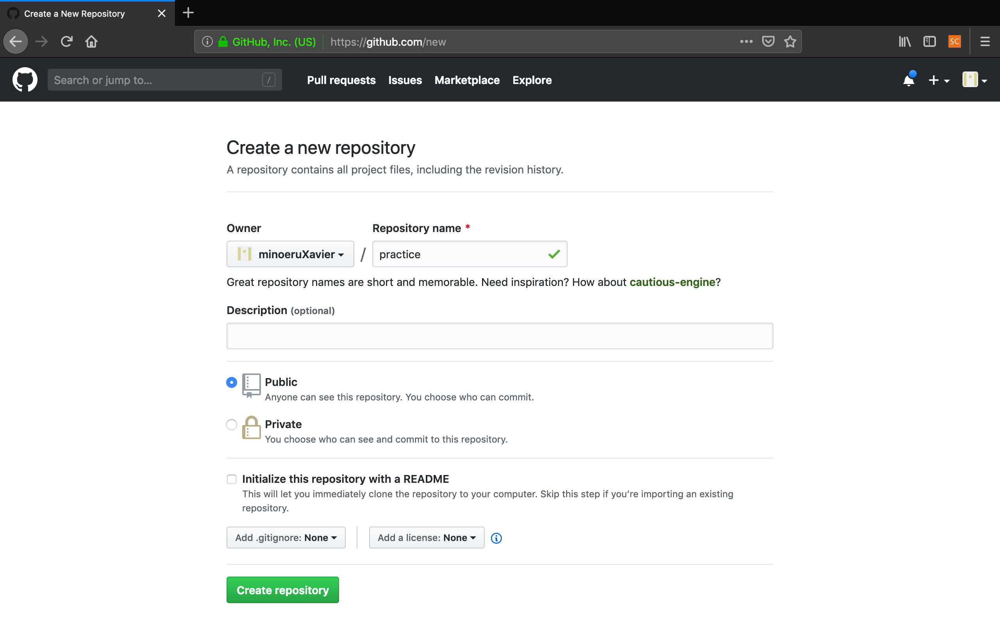
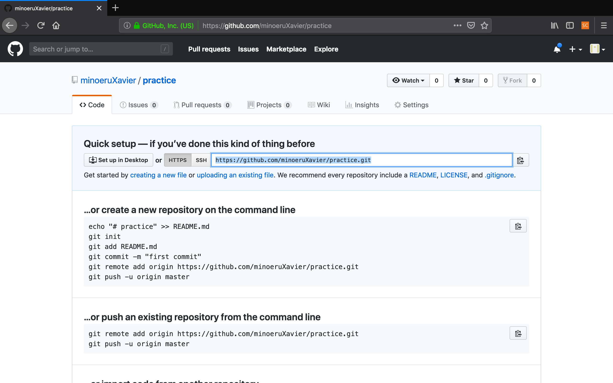
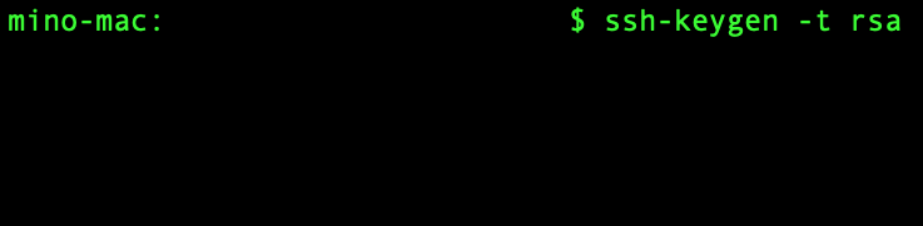
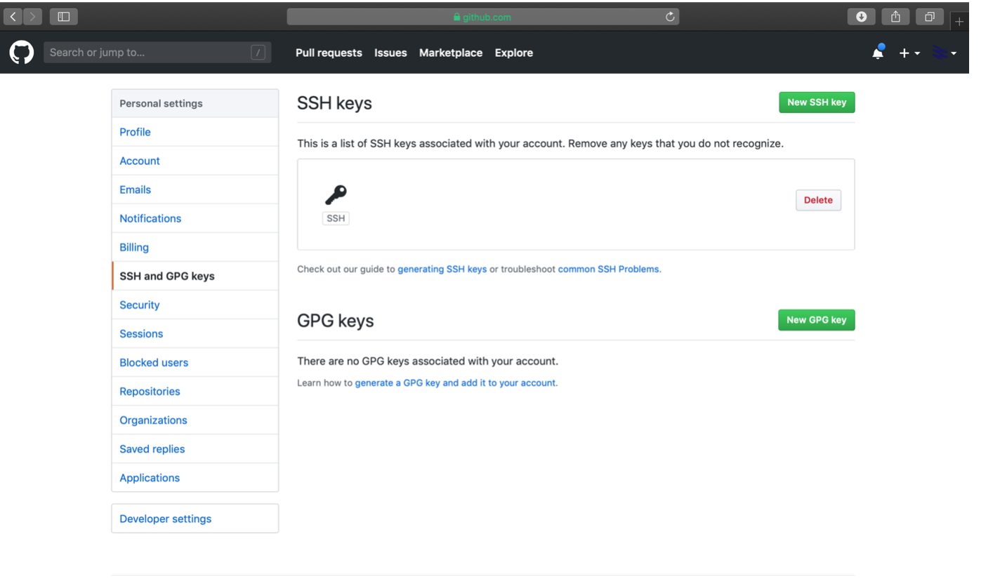
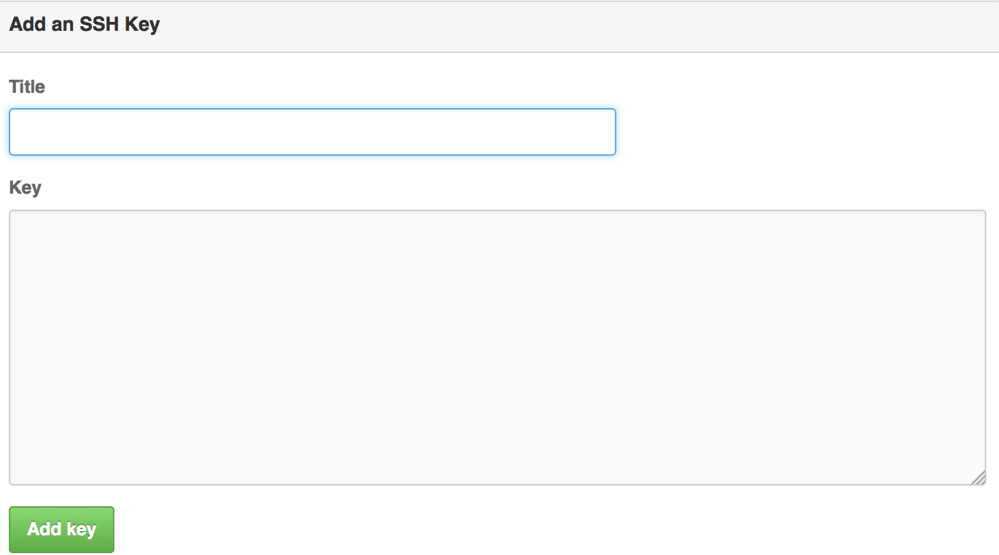

# GitHubアカウント作成ガイド

### 目次
 - Githubとは
 - アカウント作成
 - リポジトリの作成
 - SSH鍵の設定

### Githubとは
 - GitHubはGitの仕組みを利用して、ソースコードなどを保存、公開することができるようにしたウェブサービス

### アカウント作成
 [公式サイト](https://github.com)に移動しましょう
 まず、Sign upをクリックしましょう

 

 必要事項を入力していきましょう

 

 使用するプランを聞かれますので、Freeを選択しましょう

 

 ページ下部のContinueをクリックし、次のページに移動しましょう

 

 質問事項に答えたらSubmitボタンを押しましょう

 

 登録したメールアドレス宛にメールが届いているので[Verify email address]をクリックしましょう

 

 その後、以下のようなメールが届くのでこれで登録完了です

 

### リポジトリの作成
　次に、リポジトリの作成方法です
　[GitHub](https://github.com)に移動しましょう
　左上にあるCreate a repositoryをクリックします

 

 Repository nameに好きな名前を付け、Create Repositoryをクリックしてください

 

 そうすると、リポジトリが作成されます。また、リポジトリのURLも表示されます

 

### SSH鍵の作成
このままでも通信はできるのですが、送信されるデータが暗号化されません。なので、SSH鍵を作成していきたいと思います
(※ここから先は設定しなくても動くので余力のある人だけで大丈夫です)

- SSHとは：
そもそもSSHとは、Secure SHellの略で、ネットワークを経由して他のコンピュータに接続して遠隔操作を行うための仕組みのことです。この時、通信途中の情報は全て暗号化されるため、安全性を確保して行うことができます。

SSH通信を行うにはSSH鍵が必要になるので、作成していきましょう
Windows版はOSの問題上SSHが標準で使用できないためSourcetreeにSSH関係のものが付属しているらしいので、Mac版用に必要なことを書いていきます。

まず、ターミナルを開きましょう

コマンドを打てる画面が開くので、[ssh-keygen -t rsa]と入力し、エンターを押しましょう。

(rsaとは、RSA暗号という、十分大きな桁数を持った合成数の素因数分解が困難であることを安全性の根拠とした公開鍵暗号です。詳しく知りたい人は検索すると色々な情報が出てくると思います)

#### Enter file in which to save the key (/home/vagrant/.ssh/id_rsa):
と画面に出ると思うので、エンターを押しましょう（明示的に名前をつけることもできますが、今回は初なのでエンターだけで大丈夫です）
そうすると
#### Enter passphrase (empty for no passphrase):
と画面に出てくると思います。今回は特にパスワードが必要ないため、エンターを押しましょう
#### Enter same passphrase again:
これもエンターだけで大丈夫です。
#### Your identification has been saved in (入力した名前).
#### Your public key has been saved in (入力した名前).pub.
#### The key fingerprint is:
#### 11:11:11:11:11:11:11:11:11:11:11:11:11:11:11:11(英数字の一覧) vagrant@localhost.localdomain
#### The key's randomart image is:
#### 以下略
と表示され、ssh鍵が生成されます。
これで、.ssh以下にid_rsa(秘密鍵)とid_rsa.pub(公開鍵)が生成されます。

最後に
[ssh-add ~/.ssh/id_rsa]とコマンドを打つことで、今生成した鍵を登録できます。

[GitHub](https://github.com)に戻って、SSH鍵の追加を行いましょう。右上のアイコンをクリックし、「Setting」をクリックしましょう。

左のバーから「SSH and GPG keys」をクリックしましょう

このような画面が出ると思うので、「Add SSH key」をクリックしましょう
(この画面では、すでにssh鍵が追加されているので実際の画面とは異なります)

そうすると、下のような画面が表示されると思うので、適当なTitleとid_rsa.pubの中身を書きましょう。

id_rsa.pubの中身は、このように開くことで中を見ることができます。
AddKeyをクリックすることで鍵の登録が完了します。

これで、SSH鍵の作成と登録は終わりです。
