# Sourcetreeインストールガイド(Mac版)

### 目次
 - Sourcetreeとは
 - ダウンロード
 - リポジトリの作成
 - SourcetreeでGit

### Sourcetreeとは
 -  Windows と Mac に対応した Git 無料クライアント
 コマンドのような取っ掛かりづらい事を考えずにGit(ファイルの変更履歴を管理してくれるバージョン管理システム)を使えるアプリケーションの事です

### ダウンロード
 [公式サイト](https://ja.atlassian.com/software/sourcetree)からダウンロードしてきましょう。
 まず、Max OS X向けダウンロードをクリックしましょう　
 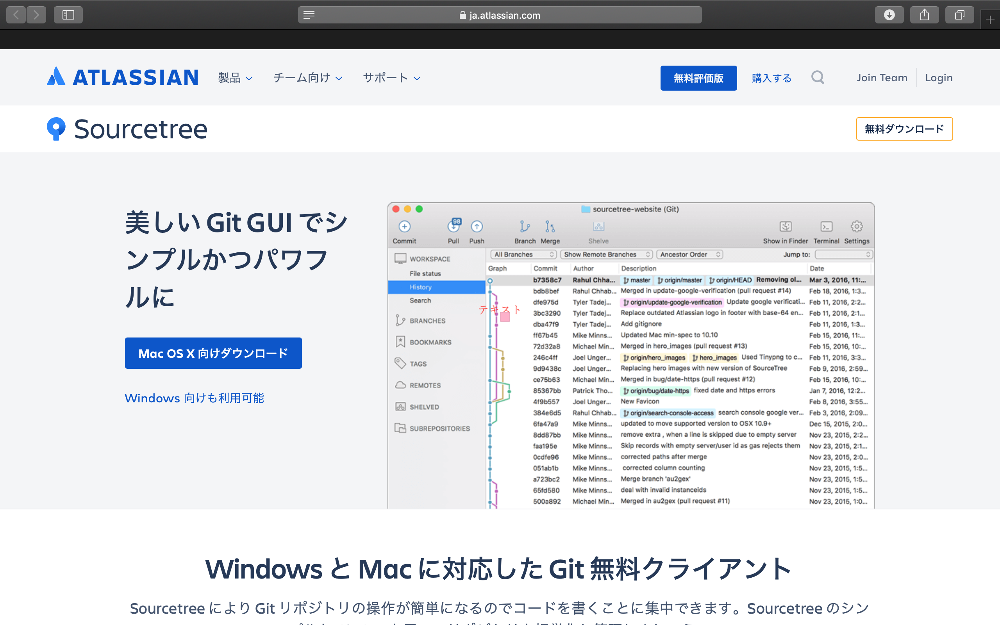

 次に、チェックボックスにチェックを入れ、ダウンロードのボタンを押しましょう

 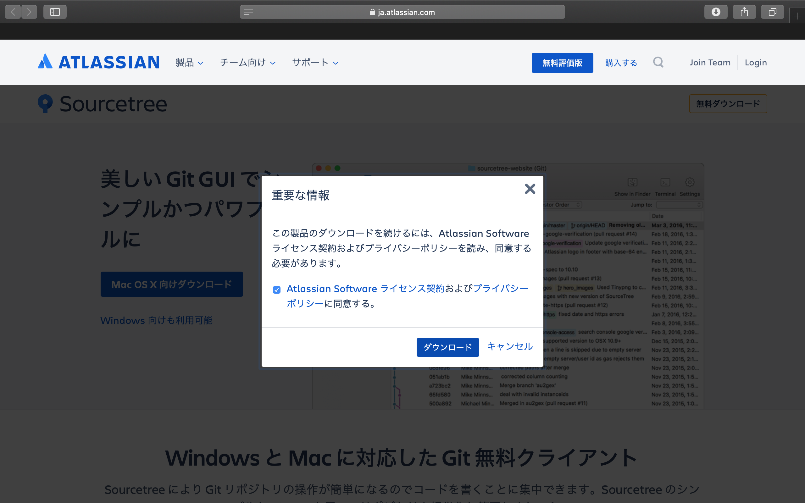

 右上のダウンロードバー(右上から３番目の水色のバー)が最後まで行ったらFinderのダウンロードに移動しましょう

 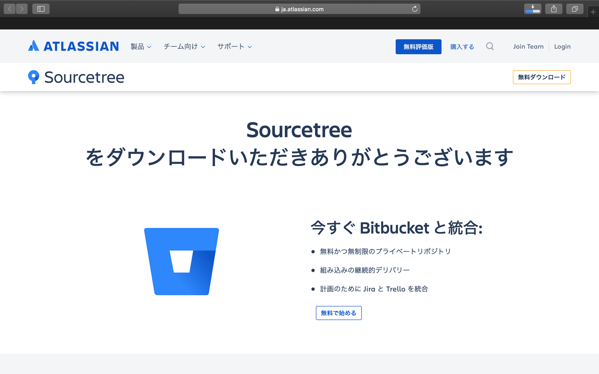

 この画面まできたら、左クリックで開きましょう

 

 問題ないので開くクリックしてください

 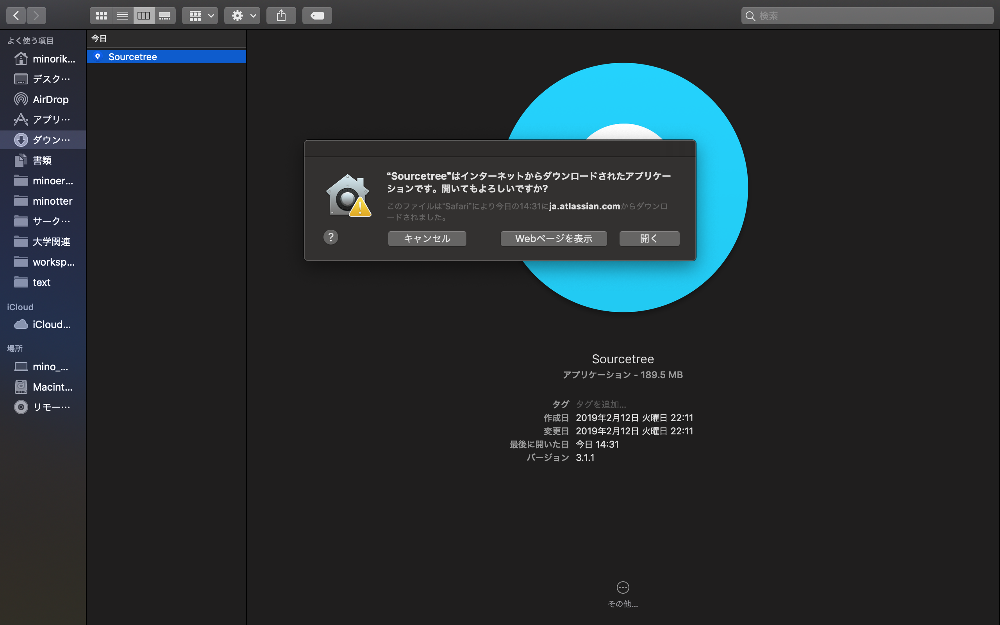

 こちらも指示されたボタンをクリック

 

 SourceTreeが開けたら右上の歯車マークから、アカウントを選択してください。

 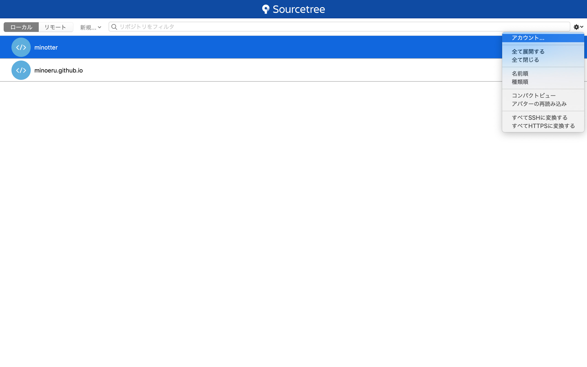

 アカウント画面が出るので、左下の追加をクリックしてください

 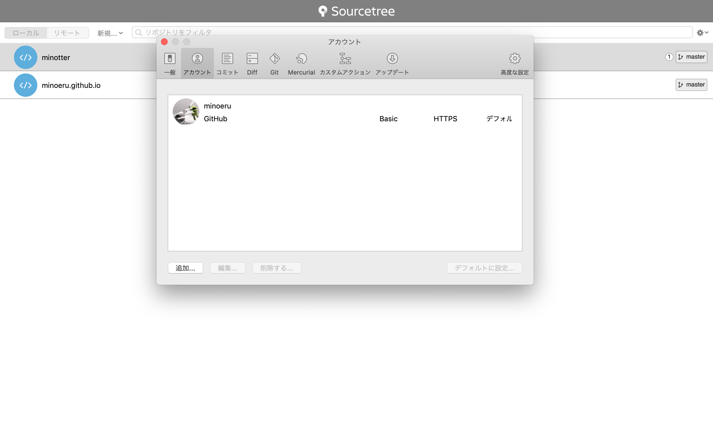

 ホストをGitHubに変更し、接続アカウントをクリックしてください。
 (GitHubのアカウントが作成できていない人は、[GitHubアカウント作成](../GitHub/GitHub.md)を参考に作成してください)

 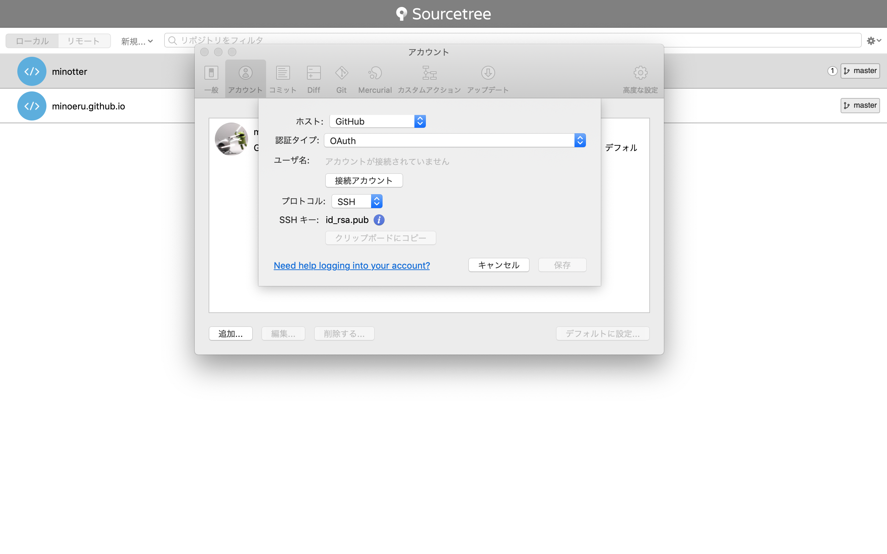

 クリックすると、GitHubへのログインが促されるのでログインしてください。
 ユーザ名に自分のユーザ名が表示されたら保存を押してください

### リポジトリの作成
　新規ボタンをクリックし、URLからクローンを押します。
(※リポジトリ：ファイルなどの状態を記録する場所。内容の変更履歴を記録することができる。データが入っているファイルの一番上の部分。) 
(※クローン：情報をコピーすること。リモートリポジトリ(Github等に作成したリポジトリ)を、ローカルリポジトリ(自分のパソコン内でバージョン管理するため等に作成したリポジトリ)として保存すること。)

 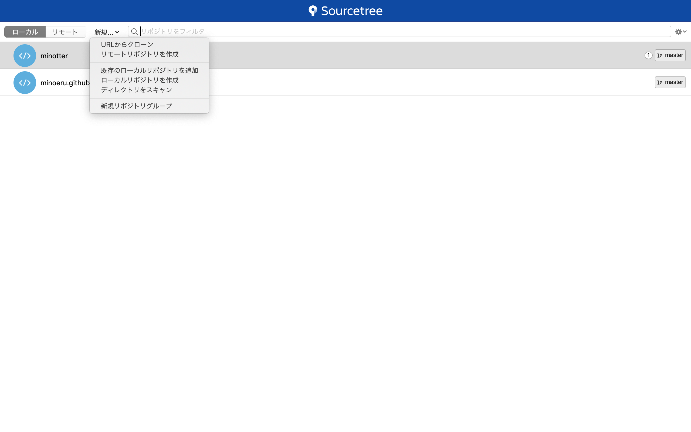

 以下のようなGitHubのリポジトリのURLをコピー＆ペーストする事でSourcetreeで管理することができます

 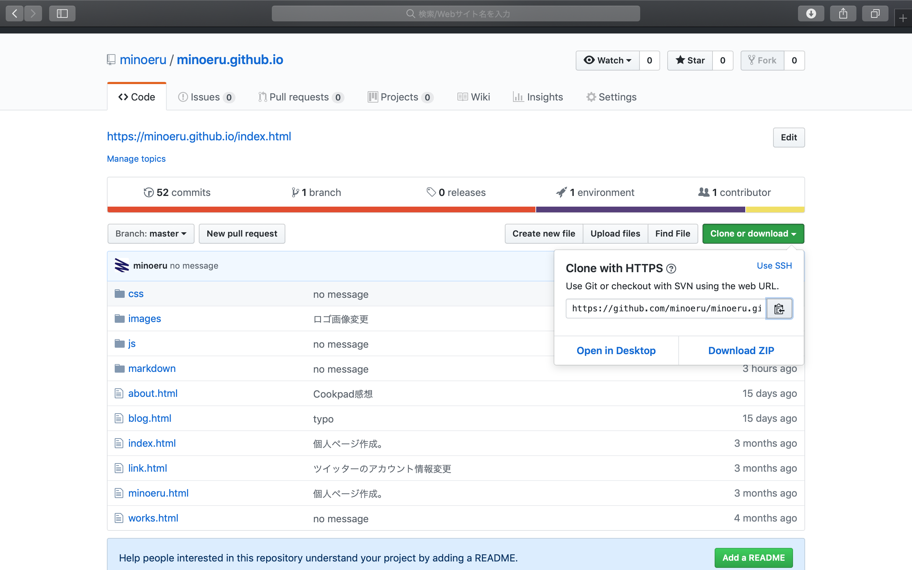

 全て埋まったらクローンを押して下さい。SourceTreeで管理できるようになります

 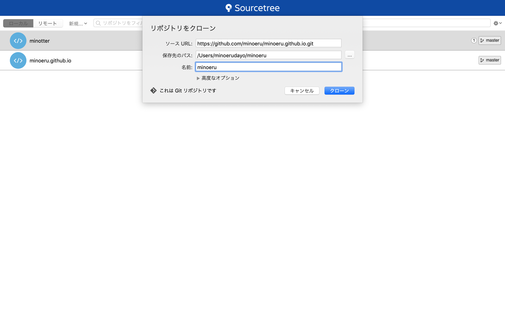

### SourcetreeでGit
 SourcetreeでGitを行う場合、まずこの画面で使いたいリポジトリを選択します

 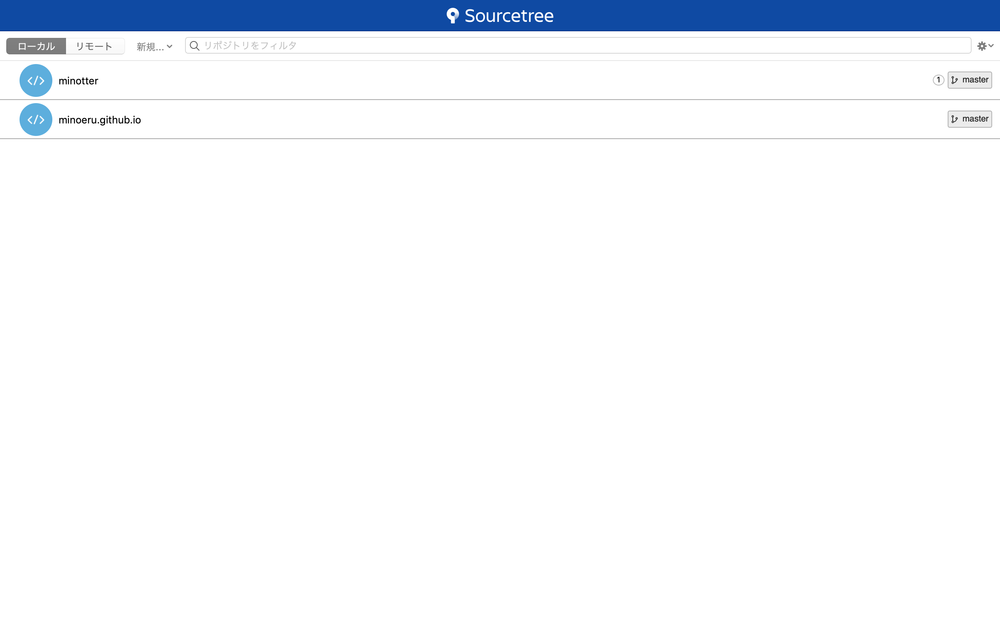

 これがメインで作業する画面です

 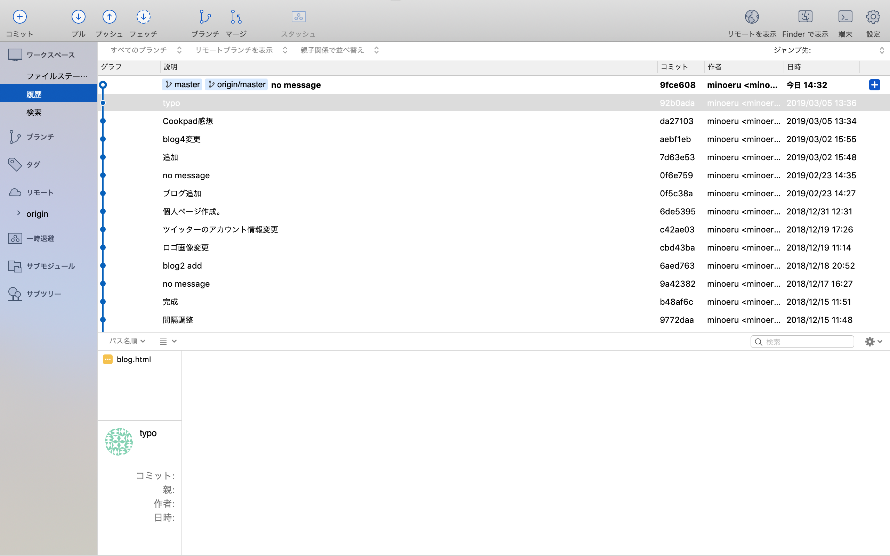

 この先は、[Sourcetree使い方、Git関連](Tutorial.md)を参考にしてください。
